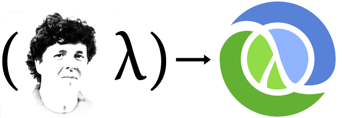
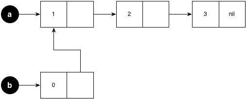

## (cons 'introduction (cons 'to (cons 'clojure '())))

<br/>
<br/>
<br/>

### November 25th, 2013

<br/>

### Ivan Willig and Peter Lubell-Doughtie
### Intent Media

---

## Outline

* What is Clojure
  * Comparison to Java and JavaScript
* Examples from the IM code base
  * Java Interoperability
* What makes Clojure a Lisp
* What makes Clojure functional
* Classless abstraction

---

## Why this talk?

---

## What is Clojure?



* Clojure was created by Rich Hickey in 2007
* Clojure is a *functional Lisp* targeting the JVM and JavaScript
* Compromise between functional programming and what is possible
  on the JVM and in the browser.

---

## What is Clojure?

* Clojure has persistent and *lazy* data structures - [Purely Functional Structures](http://www.amazon.com/Purely-Functional-Structures-Chris-Okasaki/dp/0521663504)

```clojure
(take 4 (range 10000))
```
* Pure functions are the building blocks
* Clojure works hard to keep the notion of *identity* separate from *state*
  * *State* does not determine *identity*
  * This allows for consistent notions of equality


---

## What makes Clojure a Lisp?

* Lisp is a family of programming languages that use lists to
  represent code
* Everything is in prefix notion `(+ 1 2 3 4)`
* These are called s-expressions
* Everything inside of an `s-exp` is called an atom

Calling a function in JavaScript

```javascript
funName(arg1, arg2, arg3);
```

<br/>

Calling a function in Clojure

```clojure
(fun-name arg1 arg2 arg3)
```
[See Little Schemer](http://www.amazon.com/The-Little-Schemer-4th-Edition/dp/0262560992)

---

## How Clojure compares to JavaScript

---

## Defining variables

<br/>

Defining variables in JavaScript

```javascript
var now = new Date();
```

<br/>

Defining variables in Clojure

```clojure
(def now (Date.))
```

---

## Calling instance methods

<br/>

Calling instance methods in JavaScript or Java

```javascript
now.getDay();
```

<br/>

Calling JavaScript or Java instance methods in Clojure

```clojure
(.getDay now) ;; call a method without arguments
```

---

## Calling static methods

<br/>

Calling a static method in JavaScript or Java

```javascript
Date.parse("March 21, 2012");
```

<br/>

Calling a static JavaScript or Java method in Clojure

```clojure
(Date/parse "March 21, 2012") ;; 1332302400000
```

---

## Defining functions

<br/>

Defining a function in JavaScript

```javascript
var add10 = function (x) { return x + 10; };

function add10(x) { return x + 10; };
```

<br/>

Defining a function in Clojure


```clojure
(fn [x] (- 20 x)

(def add10 (fn [x] (+ 10 x)))

(defn add10 [x] (+ 10 x))

(add10 -4) ;; 6
```

---

## Defining functions

Taking variable arguments in a function

```javascript
var reduce_PLUS = function () {
    var args = Array.prototype.slice.call(arguments);
    return plus.apply(this, args);
};

reduce_PLUS(1, 2, 3); // 6
```

<br/>

```clojure
(defn reduce+ [& args] (apply + args))

(reduce+ 1 2 3) ;; 6
```

---

## Defining functions
### Function with different arity


```clojure
(defn argcount
  ([] 0)
  ([x] 1)
  ([x y] 2)
  ([x y & more] (+ (argcount x y) (count more))))
```

---
## Defining functions

From [util.math]()

```clojure
(defn round [x precision]
  (MathUtils/round x precision))

(round 5.5 0) ;; 6.0
```

<br/>

From [util.time]()

```clojure
(defn get-requested-at [typed-data]
  (SystemTimeFactory/getMillis
   (.getRequestedAt typed-data)))
```

---

## Defining functions

From [util.cascalog]()

```clojure
(defn within-window?
  "True if t2 between t1 and a window amount of time
 after t1."
  [t1 window t2]
  (and
   (< t1 t2)
   (< t2 (+ t1 window))))

(within-window? 3 1 3.9) ;; true
(within-window? 3 1 4)   ;; false
```

---

## Namespaces

a.clj

```clojure
(ns a
  (:import [java Math]))

(def var "10")
(defn parse-int [x]
    (when-not (integer? x)
        (Integer/parseInt x)))
```


b.clj

```clojure
(ns b
 (:use     [a])
 (:use     [a :only (parse-int)])
 (:require [a :as utils]))

(utils/parse-int "10")
(utils/parse-int 10)
```


---

## Clojure basic collections

* lists      `(1 2)`
* vectors    `[1 2]`
* sets       `#{1 2}`
* hash-maps  `{:a 1}`
* strings    `"string"` (only some seq functions work on strings)

* Collections in clojure are `polymorphic`

```clojure
(def a [1 "string" :keyword {:key "value"}])

(def a {:a 1 :b "number"})
```

---

## Seq functions

* All of clojure's seq functions are `polymorphic`. That is they
  operate on different types of collections. For example,

```clojure
(conj [] :a)         ;; [:a]

(conj {:a 1} [:b 2]) ;; {:b 2, :a 1}

(conj #{:a} :b)      ;; #{:a :b}
```

* Conj is smart about what type it is given.
  * Attempts to do the fast operation for each type.
  * Returns the same type you give it.


---

## Lazy data structures

Add `doall` to evaluate an expression

From [extract.signals-test]()

```clojure
(doall (map
        signals-tests-for-site
        [SiteType/SITE1
         SiteType/SITE2
         SiteType/SITE3
         SiteType/SITE4]))
```

---

## Data structures are persistent

* Persistence means that values never change
* Because values never change they can be shared by data structures

```clojure
(def a [1 2 3])
(def b (conj 0 a))
```

```clojure
(= a [1 2 3]) ;; true
(= b [0 1 2 3]) ;; true
```

---

## Data structures are persistent

* Clojure represents this efficiently by sharing memory

<br/>



---

# `vector`

```clojure
(def a [1 2 3])       ;; create
(cons 1 [])           ;; '(1)
(cons 1 [2 3])        ;; '(1 2 3)
(count a)             ;; 3
(first a)             ;; 1
(second a)            ;; 2
(rest  a)             ;; [2 3]
(contains? [1 2 3] 0) ;; true
(contains? [1 2 3] 3) ;; false
(a 0)                 ;; 1
(get a 1)             ;; 2
(get a 10 :default)   ;; :default
(nth a 1)             ;; 2
(nth a 10)            ;; throw IndexOutOfBoundsException
```

---

# `hash-map`

A collection of key value pairs

```clojure
(def ivan {:name "Ivan Willig"
           :age 28
           :address "360 Adams Street"})

(count ivan)            ;; 3
(keys ivan)             ;; (:age :name :address)
(vals ivan)             ;; (28 "Ivan Willig" "360 Adams Street")

(:name ivan)            ;; "Ivan Willig"
(:age  ivan)            ;; 28

(contains? ivan :name)  ;; true
```

---

# `hash-map`

```clojure
(get ivan :name)            ;; "Ivan Willig"
(get ivan :sane? "No !!!")  ;; "No !!!"

(assoc ivan :mood "good")
;; {:age 28, :name "Ivan Willig", :mood "Good", 
;;  :address "360 Adams Street"}

(conj ivan ["mood" "good"])
;; {:age 28, :name "Ivan Willig", "mood" "good",
;;  :address "360 Adams Street"}

(println ivan)
;; {:age 28, :name "Ivan Willig", :address "360 Adams Street"}
```
---
# `set`

A collection of distinct elements

```clojure
(require '[clojure.set :as s])

(def a   #{1 2 3 4 5})

(def b   #{2 3 4})

(def c   #{6 7 8 9 10})

(s/subset? b a) ;; true

(s/union a c) ;; #{1 2 3 4 5 6 7 8 9 10}

(s/select integer? #{1 2 3 :a :b :c}) ;; #{1 2 3}
```

---

# `map, reduce, filter`

```clojure
(map inc [1 2 3 4 5])
;; (2 3 4 5 6)
(reduce + [1 2 3 4 5])
;; 15
(reduce + 10 [1 2 3 4 5])
;; 25)
(filter (fn [x] (< x 10)) [1 2 3 10 23 45])
;; (1 2 3)
```

---

# Iteration


```clojure
(doseq [i [1 2 3]] (println i))
;; 1
;; 2
;; 3
;; 4
;; nil

(for [i [1 2 3 4 5]] (* 3 i))
;; (3 6 9 12 15)
```

```clojure
(doseq [[key value] {:a 1 :b 2 :c 3 :d 4}]
   (println key)
   (println "---")
   (println value))
;; :a
;; ---
;; 1

```


---

# Collections are functions

```clojure
([1 2 3 4]  0)  ;; 1

(#{1 2 3 4} 0)  ;; nil

(#{1 2 3 4} 1)  ;; 1  ??? why

({:name "thing"} :name) ;; "thing"
```

---

## Defining new types

<br/>

Define a new type in JavaScript

```javascript
var Point = function (x, y) {
    this.x = x;
    this.y = y;
};
```

<br/>

Define a new type in Clojure

```clojure
(defrecord Point [x y])

(def p (Point. 10 5))

(print (:x p)) ;; 10
(print (:y p)) ;; 5
```

---

## Defining new types
### `defrecord`

```clojure
(defrecord Person [name age address])
(def dude (Person. "John Smith" 35 "1234 Ave E"))
(:name dude)     ;; "John Smith"
(= dude (Person. "John Smith" 35 "1234 Ave E")) ;; true
```

<br/>

`defrecord` implements the following Clojure and Java interfaces

```java
clojure.lang.IObj
clojure.lang.ILookup
clojure.lang.IKeywordLookup
clojure.lang.IPersistentMap
java.util.Map
java.io.Serializable
```

---
## Defining new types
### `deftype`

* Creates a new Java Types that do not implement the Clojure collection
  interfaces.


```clojure
(deftype Person [name age address])

(def dude (Person. "John Smith" 35 "1234 Ave E"))

(.name dude) ;; "John Smith"
```

---
## Extending existing types

<br/>

Extending existing types in JavaScript

```javascript
Point.prototype.distance = function (other) {
    var dx = this.x - other.x,
        dy = this.y - other.y;
    return Math.sqrt(dx * dx + dy * dy);
};
```

---

## Extending existing types in Clojure

* creates a namespaced function
* `Point` can also be a Java type

```clojure
(defprotocol IDistance
    (distance [self other]))

(extend-type Point
  IDistance
    (distance [self other]
      (let [dx (- (:x self) (:x other))
            dy (- (:y self) (:y other))]
        (Math/sqrt (+ (* dx dx)
                      (* dy dy))))))
```

---

## Extending existing types in Clojure

```clojure
(def p0 (Point. 3 10))

(def p1 (Point. 6 6))

(distance p0 p1) ;; 5.0

(distance {:x 10 :y 10} p0) ;; throws 
                            ;; IllegalArgumentException
(distance p0 {:x 10 :y 10}) ;; 5.0
```

---

## Clojure is *homoiconic*

* which is a fancy word for saying that Lisp code is Lisp data.

When we suspend evaluation we can work with the raw source code as a
Lisp tree. All code can be thought of as a tree.

<br/>

```clojure
(* (+ 2 (* 4 6))
   (+ 3 5 7))
```

<br/>


---

## Macros

* Metaprogramming
* Old, 1970s technology.
* Macros take and return `s-expr`
* Different from C macros
* Are not around at runtime

---

## Macros are different from functions
* Arguments are not evaluated before being handed to macros


```clojure
(defn unless' [expr then] (if (not expr) then nil))

(unless' false (println "should not run"))
;; should not run

(defmacro unless [expr then] `(if (not ~expr) ~then nil))

(unless false (println "should not run"))
;; nil

(defn unless2 [expr form] (if (not expr) nil (form)))

(unless2 false (fn [] (println "should not run")))
```

---

## Macros
### Examples from clojure.core


```clojure
(defmacro if-not
  ([test then] `(if-not ~test ~then nil))
  ([test then else]
  `(if (not ~test) ~then ~else)))
```

```clojure
(defmacro when
  [test & body]
  (list 'if test (cons 'do body)))
```

```clojure
(defmacro when-not
  [test & body]
  (list 'if test nil (cons 'do body)))
```

---

## Macros
### Debugging can be hard

```clojure
(macroexpand '(when-not true false))
;; (if true nil (do false))
(macroexpand-1 '(when true (println "hello world")))
;; (if true (do (println "hello world"))
```

---

## Macros
### Not around at runtime

* Actually a good thing as errors are thrown at compile time, not run
  time.
* Different from JavaScript's `eval`. Errors from `eval` are runtime

```clojure
(defmacro thing [x] (list 'if x x))  ;; silly example
(macroexpand '(thing 10)
;; (macroexpand '(thing false))
(map thing '(true false 10 "Hello")) ;; throws CompilerException
```

---

## Macros
### Issues
* There are many
* As with any meta programming, with power comes responsibility.

### Benefits
* Core language is small
* Clojure only has 16 special forms, rest are macros and functions
* pattern matching as a library [clojure.match](https://github.com/clojure/core.match)
* go async channels as a library [clojure.async](https://github.com/clojure/core.async)

---

## What makes clojure functional?

* First class functions and closures

From [math.model-metrics]()

```clojure
(defn- regression [betas signals]
  (dot-product (cons 1 signals) betas))
```

```clojure
(defn- logistic-regression
  "Compute 1/(1 + e^(-regression(beta, signals)))."
  [beta signals]
  (/ 1
      (+ 1
         (Math/exp (- (regression beta signals))))))
```

---

## What makes clojure functional?

```clojure
(defn- make-predictions
  [signals betas forecast]
  (forecast betas signals))
```

* Pass in a `forecast` function as an argument

```clojure
(make-predictions signals betas regression)
(make-predictions signals betas logistic-regression)
```
---

## Examples from the Intent Media code base

From [extract.signals]()

* Combine generic features and site specific features
* Use a Lambda function to sort by feature name

```clojure
(defn sites->features[site-type]
  (sort-by (fn [x] (.name x))
           (concat generic-features
                   (specific-features site-type))))
```

---

## Destructuring in Clojure

Abstract structural bindings

```clojure
(def point [5 7])

(let [[x y] point]
  (println "x:" x " y:" y)) ;; x: 5 y: 7
```

<br/>

```clojure
(def point {:x 5 :y 7})

(let [{x :x y :y} point]
  (println "x:" x "y:" y))  ;; x: 5 y: 7

(let [{:keys [x y]} point]
  (println "x:" x "y:" y))  ;; x: 5 y: 7
```

---

## Examples from the Intent Media code base

From [tasks.generate-signals]()

* Called from Java to build signals for a site and product type
* Parse a list of pairwise arguments into a map
* Then destructure this map into specific variables and call a function

---

## Examples from the Intent Media code base

```clojure
(defn -main [& args]
  (let [arg-map (parse-args args)
        {:keys [-stepInputBaseUrl
                -outputUrl
                -testingDateFrom
                -testingDateTo
                -trainingDateFrom
                -trainingDateTo
                -siteType
                -productCategoryType
                -publisherType
                -dataType]} arg-map
        base-input-path (UrlHelper/decode -stepInputBaseUrl)
        output-path (UrlHelper/decode -outputUrl)
        publisher-type (PublisherType/valueOf -publisherType)
        site-type (SiteType/valueOf -siteType)]
        ;; some method call
        ))
```

---


## Thank you

<br/>

## Questions?

<br/>
<br/>

### Try Clojure in your browser, [http://tryclj.com/](http://tryclj.com/)

---

## Credits

Rich Hickey image from [a blog]
(http://www.flyingmachinestudios.com/programming/the-unofficial-guide-to-rich-hickeys-brain/)

S-expr image from [SICP]
(http://mitpress.mit.edu/sicp/full-text/book/book-Z-H-10.html#%_sec_1.1.6)

